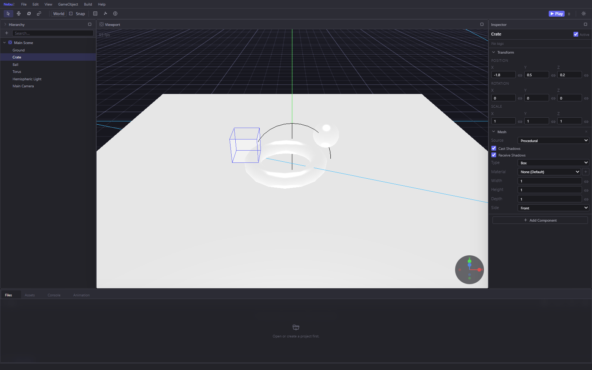

# Nebu2

A Unity-inspired scene editor for [Babylon.js](https://www.babylonjs.com/), running entirely in the browser.

Nebu2 gives you a dockable panel workspace, an entity/component hierarchy, a live inspector, gizmo-based
manipulation, a TypeScript scripting runtime with Monaco, an animation timeline, a plugin system, and a
one-click export that produces a standalone playable build.

Projects are read and written directly to a folder on your disk through the
[File System Access API](https://developer.mozilla.org/en-US/docs/Web/API/File_System_API) — there is no
server, no upload, and no account.



---

## Project status

**Pre-alpha.** The editor runs and the core loop (create → edit → script → play → export) works, but this
is an in-progress personal project, not a released tool. Before relying on it, read
[Known issues](#known-issues) below.

| | |
|---|---|
| Runtime | Works — `npm run dev` and `npx vite build` both succeed |
| Strict typecheck | **Fails** — `vue-tsc` reports 106 errors, so `npm run build` does not complete |
| Test suite | None |
| Successor to | [Pryme8/NeBu](https://github.com/Pryme8/NeBu) |

---

## Requirements

- **Node.js 20+**
- **A Chromium-based browser** (Chrome or Edge). Opening and saving projects uses the File System Access
  API, which Firefox and Safari do not implement. The editor shell itself loads anywhere, but every
  project-backed feature (Files, Assets, scripts, save/load, export) needs Chromium.

## Quick start

```bash
npm install
```

```bash
npm run dev
```

Then open <http://localhost:5173>.

To create a project: **File → New Project…**, pick an empty folder, and grant read/write access. Nebu2
writes a `.nebu` marker file plus `scenes/`, `assets/`, and `scripts/` folders into it.

> `npm run build` runs `vue-tsc -b && vite build` and currently stops at the typecheck. To produce a
> bundle today, run `npx vite build` directly — Vite strips types with esbuild and builds successfully.

---

## Features at a glance

| Area | What you get |
|---|---|
| **Workspace** | Dockable, draggable, resizable floating panels with tab groups; layout persists across sessions |
| **Scene** | ECS hierarchy with parenting, drag-and-drop reparenting, multi-scene projects |
| **Components** | Transform, Mesh (14 primitives + imported models), Light (4 types), Camera (2 types), Animation, Script, plus plugin-contributed components |
| **Inspector** | Schema-driven UI generated from each component's `onInspectorDraw()` |
| **Gizmos** | Custom translate / rotate / scale gizmos with world/local space and snapping |
| **Scripting** | TypeScript `NebuScript` classes compiled in-browser, Monaco editor with full Babylon IntelliSense, inspector-exposed properties |
| **Animation** | Clip/track/keyframe data model, NLE-style timeline, Babylon `AnimationGroup` playback |
| **Materials** | Standard / PBR / Shader material assets with texture channel slots |
| **Assets** | `.glb`/`.gltf` model import with material + texture extraction, texture thumbnails, `.meta` sidecars |
| **Prefabs** | Serialize an entity subtree and re-instantiate it |
| **Physics** | Havok rigid bodies, colliders and constraints via the built-in `@nebu/plugin-havok` |
| **Plugins** | Typed `NebuPlugin` contract — contribute components, systems and ambient TS types |
| **Export** | Zip a self-contained `index.html` (or a file-based bundle) with scenes, assets, materials and scripts |
| **Undo/redo** | Command-pattern history across entity, component and animation edits |

**[→ Full feature walkthrough with screenshots](docs/FEATURES.md)**

---

## Documentation

| Document | Contents |
|---|---|
| [docs/FEATURES.md](docs/FEATURES.md) | Every panel, tool and dialog, with screenshots |
| [docs/ARCHITECTURE.md](docs/ARCHITECTURE.md) | ECS, stores, layer stack, command pattern, project file format |
| [docs/SCRIPTING.md](docs/SCRIPTING.md) | `NebuScript` lifecycle, exposed properties, the compile pipeline |
| [packages/nebu-plugin-havok/PLUGIN_GUIDE.md](packages/nebu-plugin-havok/PLUGIN_GUIDE.md) | Writing a plugin, using the Havok plugin as reference |
| [ANIMATION_PLAN.md](ANIMATION_PLAN.md) | Design document for the animation system |
| [.github/copilot-instructions.md](.github/copilot-instructions.md) | Coding conventions enforced across the codebase |

---

## Tech stack

- **Vue 3** (Composition API, `<script setup>`) + **Pinia**
- **Vite 7** + **Tailwind CSS v4**
- **TypeScript** (strict)
- **Babylon.js 9** (`@babylonjs/core`, `/loaders`, `/materials`, `/havok`)
- **Monaco Editor** for script authoring
- **Sucrase** for in-browser TypeScript→JavaScript transpilation
- **fflate** for zip generation

## Repository layout

```
src/
  components/
    base/       Atoms — BaseButton, BaseIcon, BaseNumericInput, MonacoEditor, …
    panels/     Panel windowing system — PanelManager, PanelWindow, PanelGroup
    editor/     Editor panels & dialogs — Hierarchy, Inspector, Animation, Export, …
  composables/  useDraggable, useResizable, useEditorGizmos
  core/
    ecs/        Entity, Component, System, World + built-in components
    commands/   Undoable command objects (entity, component, animation)
    scripting/  NebuScript, ScriptEngine, runtime + editor systems
    export/     ExportBuilder and the built-in HTML runtime templates
    scene/      NebuScene, viewport widgets, custom gizmos
    layers/     LayerStack event routing (EditorLayer / RenderLayer)
    serialization/  Prefab and session serializers
  lib/fs/       File System Access wrapper + script file watcher
  stores/       Pinia stores — scene, project, asset, material, script, panel, …
  types/        Shared interfaces and type aliases
packages/
  nebu-plugin-havok/   Built-in Havok physics plugin (workspace package)
docs/           Documentation and screenshots
```

---

## Known issues

These were found while auditing the current tree. None of them block the editor from running.

1. **`npm run build` fails the typecheck.** `vue-tsc -b` reports 106 errors across 25 files —
   mostly `strictNullChecks` violations in `src/stores/assetStore.ts` (29), a `Vec3`/`Vector3`
   mix-up in `src/stores/projectStore.ts`, and missing `static exposedProps` typing on
   `new () => NebuScript`. `npx vite build` still produces a working bundle.

2. **Adding an animation property track throws.**
   [`AnimationComponent.syncToBabylon()`](src/core/ecs/components/AnimationComponent.ts) calls
   `group.normalize(0, clip.frameCount)` on a track whose `keyframes` array is still empty
   (tracks are created empty in [`AddAnimationTrackCommand`](src/core/commands/animation.ts)).
   Babylon's `normalize()` reads `keys[0].frame`, so it throws
   `TypeError: Cannot read properties of undefined (reading 'frame')` and the new track never
   reaches the timeline. **Add Track is currently non-functional.**

3. **Menu bar items are largely stubs.** In [`AppMenuBar.vue`](src/components/editor/AppMenuBar.vue)
   the entire Edit, GameObject and Help menus — and most of View — are wired to `action: () => {}`.
   Undo/redo work via <kbd>Ctrl</kbd>+<kbd>Z</kbd>/<kbd>Y</kbd>, not via the menu.

4. **Tool shortcuts fire while typing.** `EditorLayer._handleToolShortcut` only checks for Ctrl/Alt,
   not for input focus, so typing `q`, `w`, `e` or `r` in the hierarchy search box, an entity rename
   field or any inspector text input silently switches the active gizmo tool.
   (`App.vue`'s undo/redo handler does guard against this — `EditorLayer` does not.)

5. **Bundle size.** The main chunk is ~8 MB (1.8 MB gzipped) and Monaco adds ~11 MB (2.2 MB gzipped).
   Monaco is already split into a lazy chunk; Babylon is not yet trimmed.

6. **Export caveat.** The export dialog notes that materials and scripts are applied at runtime in
   "V2" — verify exported bundles before shipping them.

7. **No automated tests.**

---

## License

[MIT](LICENSE) © Pryme8
