# Nebu2 — Feature Guide

A walkthrough of everything the editor currently does, panel by panel.
All screenshots are of the running editor at 1600×1000.

> Screenshots were captured against a scratch scene built from primitives with a single hemispheric
> light and no materials assigned, which is why the demo geometry renders flat white.

**Contents**

- [The workspace](#the-workspace)
- [Menu bar](#menu-bar)
- [Toolbar](#toolbar)
- [Hierarchy panel](#hierarchy-panel)
- [Viewport](#viewport)
- [Gizmos](#gizmos)
- [Inspector panel](#inspector-panel)
  - [Transform](#transform)
  - [Mesh](#mesh)
  - [Light](#light)
  - [Camera](#camera)
  - [Animation](#animation-component)
  - [Script](#script-component)
- [Animation timeline](#animation-timeline)
- [Console panel](#console-panel)
- [Files and Assets panels](#files-and-assets-panels)
- [Materials](#materials)
- [Prefabs](#prefabs)
- [Script editor](#script-editor)
- [Play mode](#play-mode)
- [Viewport settings](#viewport-settings)
- [Project settings](#project-settings)
- [Plugins](#plugins)
- [Export](#export)
- [Undo and redo](#undo-and-redo)
- [Session persistence](#session-persistence)

---

## The workspace

Nebu2 opens into a familiar four-zone editor layout: Hierarchy on the left, Viewport in the centre,
Inspector on the right, and a tabbed dock along the bottom holding **Files**, **Assets**, **Console**
and **Animation**.

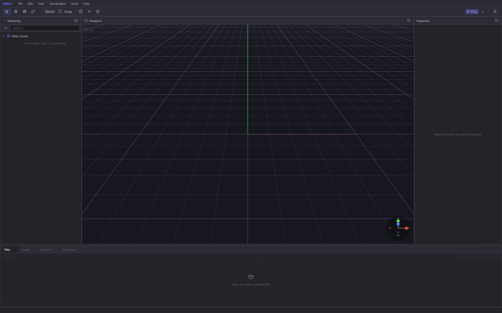

Every panel is a floating window managed by `panelStore`:

- **Drag** a title bar to move a panel.
- **Drag** any edge or corner to resize it (`PanelResizeHandles`).
- **Drag** one panel onto another to merge them into a **tab group** (`PanelGroup`).
- **Maximize** a panel with the button in its title bar.
- Panel rects are stored **normalized** (0–1 of the editor viewport), so the layout survives window
  resizing.

Panels can declare `requiresScene` or `requiresProject`, which is why Files and Assets show
"Open or create a project first." until a project folder is opened.

**Reset the layout** with **View → Reset Layout**.

---

## Menu bar

`Nebu2 · File · Edit · View · GameObject · Build · Help`

Working entries:

| Menu | Item | Action |
|---|---|---|
| File | New Project… | Prompts for a name, then a folder picker; scaffolds `.nebu`, `scenes/`, `assets/`, `scripts/` |
| File | Open Project… | Folder picker; rejects folders with no `.nebu` marker |
| File | Save | Writes the active scene and project manifest; greys out with no project open |
| Edit | Undo / Redo | Same history as <kbd>Ctrl</kbd>+<kbd>Z</kbd>/<kbd>Y</kbd>; greys out when the stack is empty |
| Edit | Cut / Copy / Paste | Entity clipboard — captures the whole subtree, so Cut survives the source being deleted and a copy can be pasted repeatedly |
| Edit | Duplicate / Delete | Acts on the selection; both undoable |
| Edit | Project Settings… | Opens the [Project Settings](#project-settings) dialog |
| View | Hierarchy / Inspector / Files / Assets / Console / Animation | Brings that panel to the front, activating its tab if it's in a group |
| View | Viewport Settings… | Opens the [Viewport Settings](#viewport-settings) dialog |
| View | Reset Layout | Clears the saved session and reloads |
| GameObject | Create Empty | New empty entity under the selection |
| GameObject | 3D Object ▸ | Submenu: Box, Sphere, Cylinder, Capsule, Torus, TorusKnot, Ground, Plane, Disc, IcoSphere |
| GameObject | Light ▸ | Submenu: Hemispheric, Directional, Spot, Point |
| GameObject | Camera | New entity with a Camera component |
| Build | Export Project… (`Ctrl+B`) | Opens the [Export](#export) dialog |
| Help | Documentation / About | Opens the README; shows the about toast |

Items that need a selection, an open project, or a non-empty undo stack grey themselves out rather
than failing silently.

> **Note:** the shortcuts shown beside menu items are labels. Only <kbd>Ctrl</kbd>+<kbd>Z</kbd>,
> <kbd>Ctrl</kbd>+<kbd>Y</kbd> and the <kbd>Q</kbd>/<kbd>W</kbd>/<kbd>E</kbd>/<kbd>R</kbd> tool keys
> are actually bound to the keyboard; the rest are menu-only for now.

---

## Toolbar

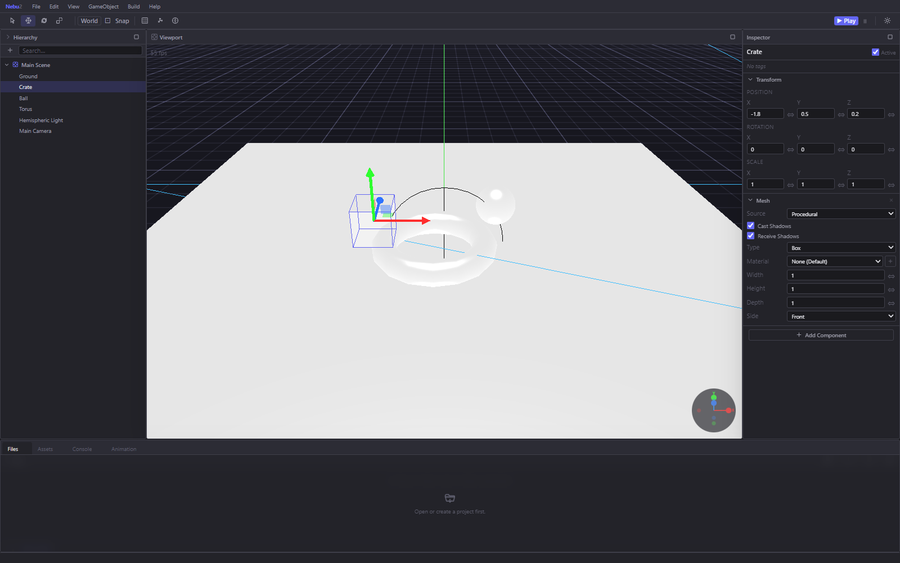

| Control | Purpose |
|---|---|
| Select / Translate / Rotate / Scale | Active manipulation tool — <kbd>Q</kbd> <kbd>W</kbd> <kbd>E</kbd> <kbd>R</kbd> (suppressed while a text field has focus) |
| World / Local | Gizmo orientation space |
| Snap | Toggles snapping; increments live in `editorStore` (`snapTranslation`, `snapRotation`, `snapScale`) |
| Grid | Toggles the ground grid |
| World axis | Toggles the origin axis lines |
| Camera axis | Toggles the orientation gizmo in the viewport's bottom-right corner |
| ▶ Play / ⏹ Stop | Enters and leaves [play mode](#play-mode) — disabled until the scene has a Camera component |
| ⏸ | Pause |
| ⚙ | [Viewport settings](#viewport-settings) |

---

## Hierarchy panel

The entity tree for the active scene, rooted at the scene itself.

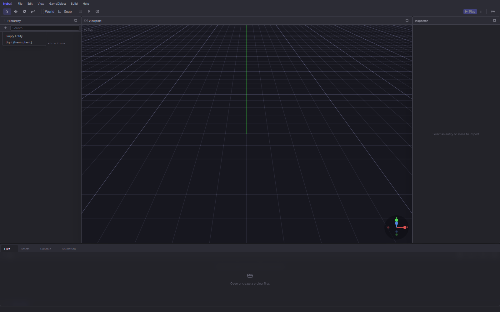

- **+** adds an entity. Two presets exist: **Empty Entity** and **Light (Hemispheric)**. Everything
  else is built by adding components in the Inspector.
- New entities are parented to the current selection — click the scene row first to create at root level.
- **Double-click** a name to rename inline.
- **Drag** a row onto another to reparent; drop on the scene row (or the strip below the tree) to
  un-parent. Hold <kbd>Alt</kbd> while dropping to **copy** instead of move.
- Per-row **visibility toggle** and **delete** buttons appear on hover.
- The **search box** filters the tree by name.
- Prefab roots are badged `prefab`.
- Drag targets also accept prefabs and models dropped from the Files panel.

---

## Viewport

A live Babylon.js scene with an editor fly camera.

- **Right-drag / middle-drag** to orbit and pan.
- **<kbd>W</kbd><kbd>A</kbd><kbd>S</kbd><kbd>D</kbd>** to fly, **<kbd>Shift</kbd>** to boost.
- Click a mesh to select its entity; the selection is outlined.
- An **fps counter** sits in the top-left.
- A **camera orientation gizmo** sits in the bottom-right (`ViewportCameraAxis`).
- Components can draw **viewport widgets** — line-based helpers such as the light's range circle —
  by implementing `onWidgetDraw()`. These render only in the editor, never at runtime.

---

## Gizmos

Nebu2 ships custom gizmos rather than Babylon's stock ones
(`core/scene/gizmos/CustomPositionGizmo`, `CustomRotationGizmo`, `CustomScaleGizmo`).

| Translate | Rotate | Scale |
|---|---|---|
|  | 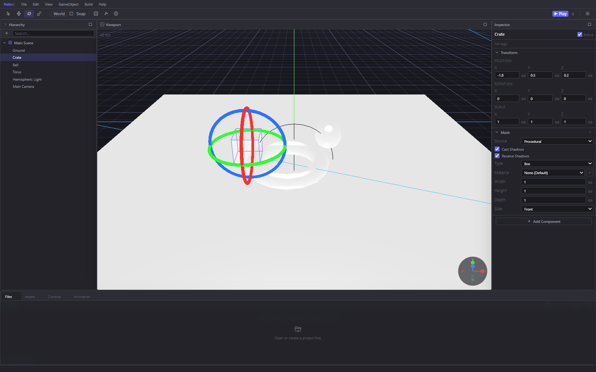 | 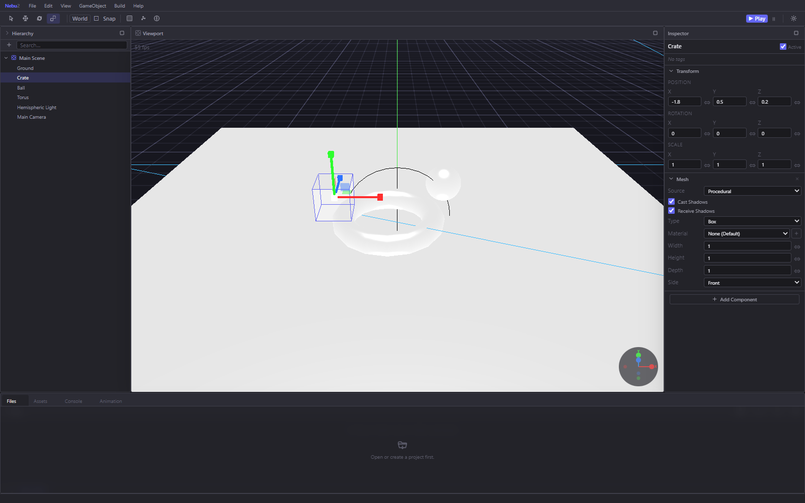 |

Each supports single-axis and planar handles, world/local space, and snapping. Drags are committed
through the command store, so gizmo edits are undoable.

---

## Inspector panel

The Inspector is **schema-driven**. Components return a declarative `InspectorSchema` from
`onInspectorDraw()`, and `ComponentInspector.vue` renders the matching widgets. Adding a field to a
component requires no UI code.

Supported field types: `number`, `boolean`, `string`, `vec3`, `color3`, `color4`, `enum`,
`entity-ref`, `material-ref`, `texture-ref`, `model-ref`, and `animation-clip-list`.

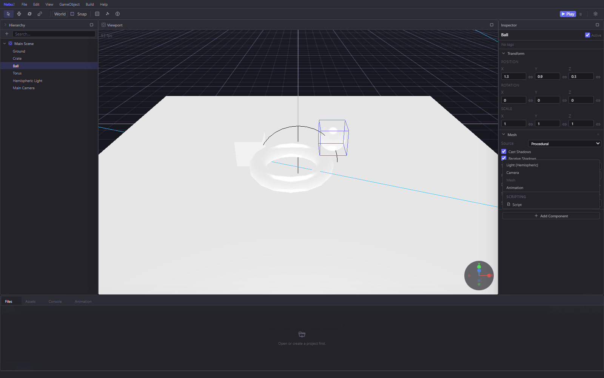

The **Add Component** menu lists built-in components plus anything contributed by active plugins,
and a **Scripting** section for attaching a script slot. Components already present are disabled.

### Transform

Position, Rotation and Scale as X/Y/Z triples. Each field is a `BaseNumericInput` — type a value, or
**drag the ⇔ handle to scrub**.

### Mesh


| Field | Notes |
|---|---|
| Source | `Procedural` or `Model Asset` |
| Cast / Receive Shadows | Per-mesh shadow flags |
| Type | 14 procedural primitives: Box, Sphere, Cylinder, Capsule, Torus, TorusKnot, Ground, Plane, Disc, IcoSphere, Polyhedron, TiledPlane, TiledBox, TiledGround |
| Material | Pick a material asset, or **+** to create one |
| Size | Primitive-specific parameters (Width/Height/Depth, diameter, segments, …) |
| Side | Front, Back or Double orientation |

Switching **Source** to `Model Asset` binds the mesh to an imported `.glb`/`.gltf` asset instead.

### Light


Four Babylon light types — **Hemispheric**, **Directional**, **Spot**, **Point** — with intensity,
diffuse/specular colour, range, and type-specific fields (spot angle and exponent, directional
direction). Changing the type rebuilds the underlying Babylon light in place.

Lights draw a viewport widget showing their direction and range.

### Camera

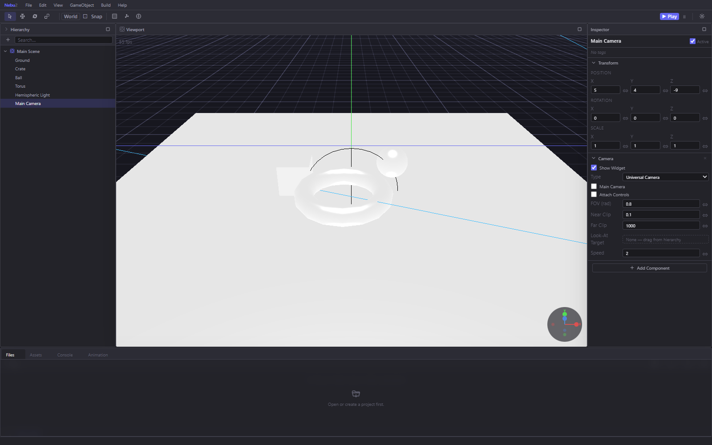

**UniversalCamera** or **ArcRotateCamera**, with FOV, near/far clip, and per-type controls. The
scene needs at least one Camera component before Play is enabled — the toolbar button stays disabled
and explains why on hover.

### Animation component

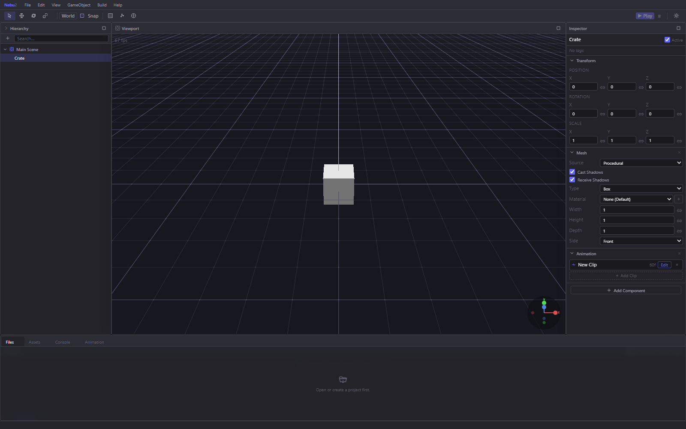

Holds a list of **clips**. Each clip row shows its name and frame count with **Edit** (opens the
[timeline](#animation-timeline)) and **delete** buttons, plus **Add Clip** below.

### Script component

Attaching **Script** creates a script *slot* with a stable `slotId`. Assign a `.ts` file from the
project and the inspector renders that class's `static exposedProps` as editable fields. Each slot
also carries an `executionOrder` (higher runs first; ties fall back to entity `sortOrder`).

A script that fails to compile is flagged with a ⚠ badge and disabled.

---

## Animation timeline

An NLE-style timeline docked at the bottom, driven by `animationStore`.

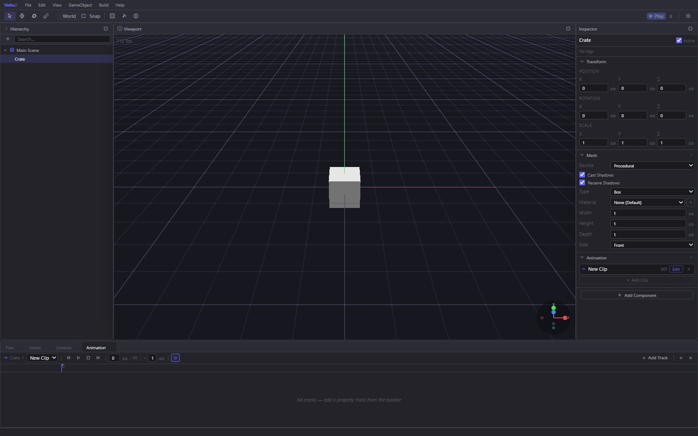

- **Transport**: go to first frame, play/pause, stop, go to last frame.
- **Frame field** and total frame count (`0 / 60`), plus a playback **speed** field.
- **Snap-to-frame** toggle.
- **Ruler** with a draggable playhead.
- **Zoom in/out**.
- **Add Track** opens a property catalogue:

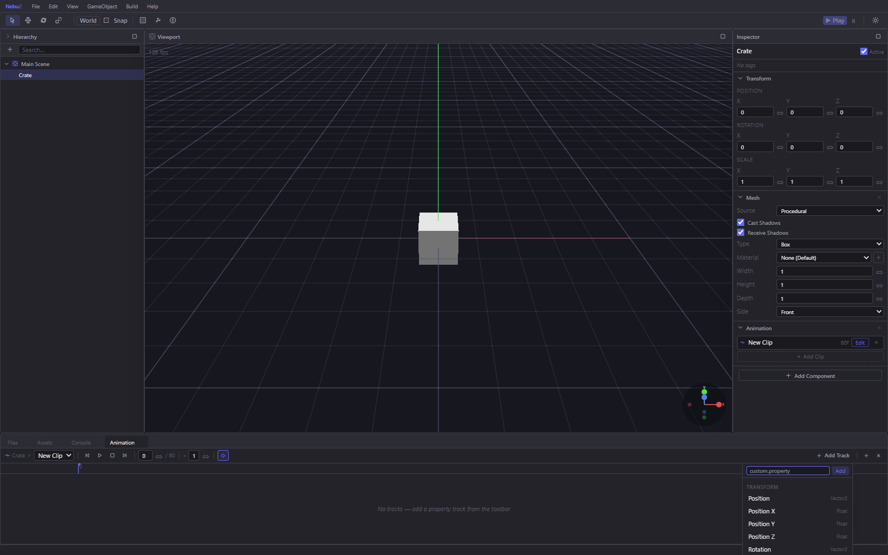

Tracks can be picked from a grouped catalogue (Transform: Position/Rotation/Scale and their
individual components, and more) or typed in freehand as a custom property path.

The data model (`types/animation.ts`) supports clips, tracks, keyframes, per-track easing
(the Babylon easing families), loop modes (Cycle / Constant / Relative / Yoyo), value types
(Float, Vector3, Vector2, Quaternion, Color3, Color4, Matrix), blending and speed ratio.
`AnimationComponent` compiles all of it into Babylon `Animation` objects inside an `AnimationGroup`;
`AnimationSystem` drives playback in play mode.

Tracks start empty and are skipped when the clip is compiled to Babylon, so a clip is only turned
into an `AnimationGroup` once at least one track has a keyframe.

---

## Console panel

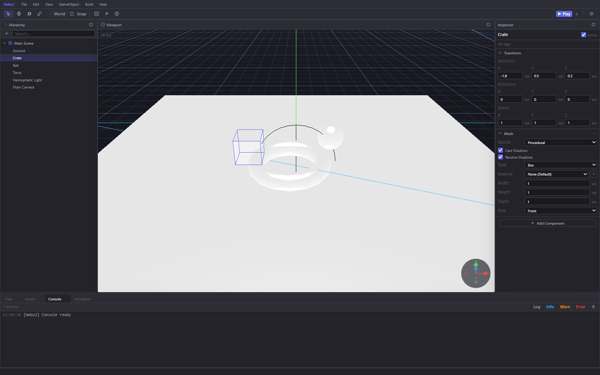

Captures editor and script output. Entries are colour-coded by level (`log`, `info`, `warn`,
`error`), each level can be toggled as a filter, and the whole buffer can be cleared. Script
compilation errors are routed here as well as to toast notifications.

---

## Files and Assets panels

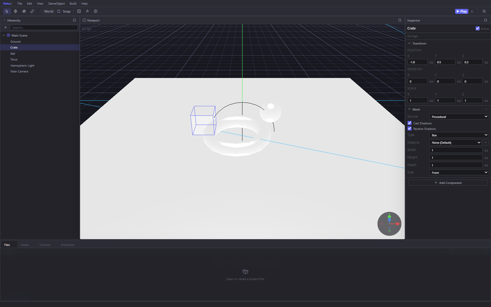

The **Files** panel is a project browser over the real folder on disk:

- Toolbar actions: **New Scene**, **New Folder**, **New Material**, **Refresh**.
- Tree navigation with per-kind icons (`scene`, `model`, `texture`, `material`, `script`, `prefab`,
  `folder`).
- Items are **draggable** into the Hierarchy — drop a model to instantiate its mesh tree, drop a
  prefab to instantiate it.
- Scenes can carry a **thumbnail** captured from the viewport.
- Missing files are badged.

The **Assets** panel shows imported binary assets with texture thumbnails.

**Import pipeline.** Importing a `.glb`/`.gltf` writes the binary into `assets/` alongside a
`.meta` sidecar containing a stable GUID, import settings (`scale`, `flipYZ`) and a `modelInfo`
manifest: the full mesh hierarchy with local transforms and triangle counts, plus every material and
texture found in the file. Materials are extracted into `.mat` assets and textures written out as
image files, so imported content becomes editable project data rather than an opaque blob.

A `ScriptWatcher` polls script files on disk and hot-reloads changed classes.

---

## Materials

Material assets (`.mat`) are defined by `core/materials/MaterialDef.ts` and support
**Standard**, **PBR**, **Shader**, **Custom** and **PBRCustom** types.

- Standard: diffuse/specular/emissive/ambient colours, specular power, alpha, wireframe,
  back-face culling, and eight texture channels (diffuse, ambient, opacity, emissive, specular,
  bump, reflection, lightmap).
- PBR: albedo, reflectivity, emissive, metallic, roughness and the matching texture slots.

Texture channels are stored as asset GUIDs, and `MaterialPreviewCanvas.vue` renders a live sphere
preview of the material being edited.

---

## Prefabs

`PrefabSerializer` serializes an entity subtree — or an entire scene — to a `.prefab` file.
Dropping one into the Hierarchy re-instantiates it, and the instantiated root carries a
`PrefabInstanceComponent` linking it back to the source. Instances can be saved back out as a new
unique prefab.

---

## Script editor

Scripts are authored in **Monaco**, either in a docked panel or a fullscreen dialog.

The Vite plugin `bundlePackageTypes` (see [`vite.config.ts`](../vite.config.ts)) walks
`@babylonjs/core` and `@babylonjs/havok` at build time, collects every `.d.ts`, and exposes them as a
virtual module. Monaco's TypeScript service loads those declarations, so bare-specifier imports like

```ts
import { Vector3 } from '@babylonjs/core'
```

resolve with full IntelliSense inside user scripts. Nebu's own globals (`NebuScript`, `Entity`,
`World`, component classes) are injected as ambient declarations from `lib/nebuScriptTypes.ts`, and
each active plugin can contribute its own via `NebuPlugin.ambientTypes`.

Monaco is code-split into its own lazy chunk so it only loads when the editor is first opened.

See [SCRIPTING.md](SCRIPTING.md) for the runtime API.

---

## Play mode

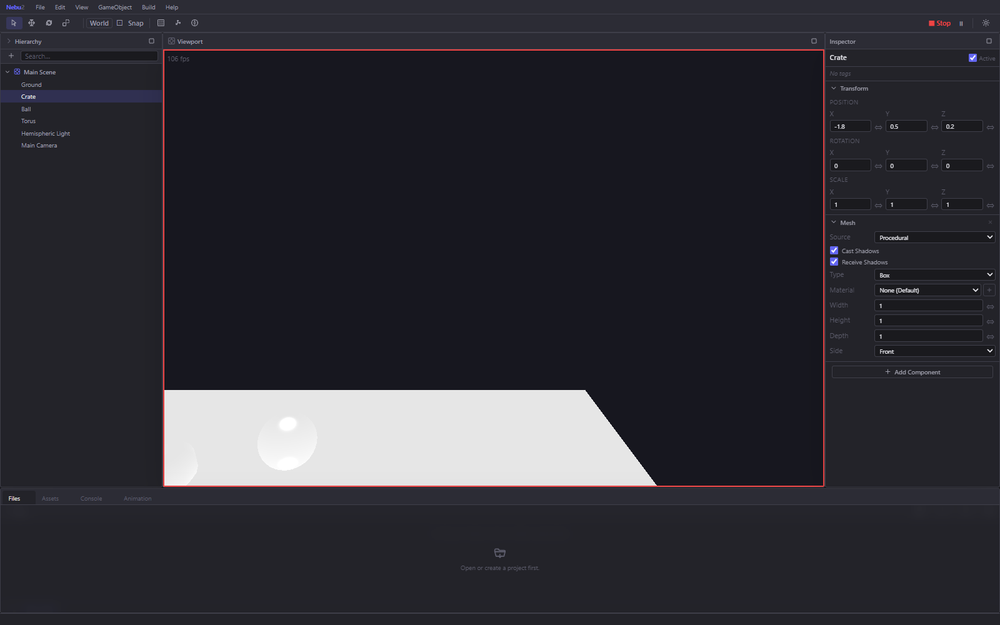

Pressing **▶ Play**:

- switches rendering to the scene's Camera component,
- hides editor-only widgets (grid, axes, gizmos, light helpers),
- outlines the viewport in red,
- runs script lifecycle hooks (`onAwake` → `onStart` → `onUpdate` / `onLateUpdate` / `onFixedUpdate`),
- starts `AnimationSystem` and any plugin systems such as Havok physics.

**⏹ Stop** restores the editor camera and the pre-play scene state. Play is disabled until a Camera
component exists.

---

## Viewport settings

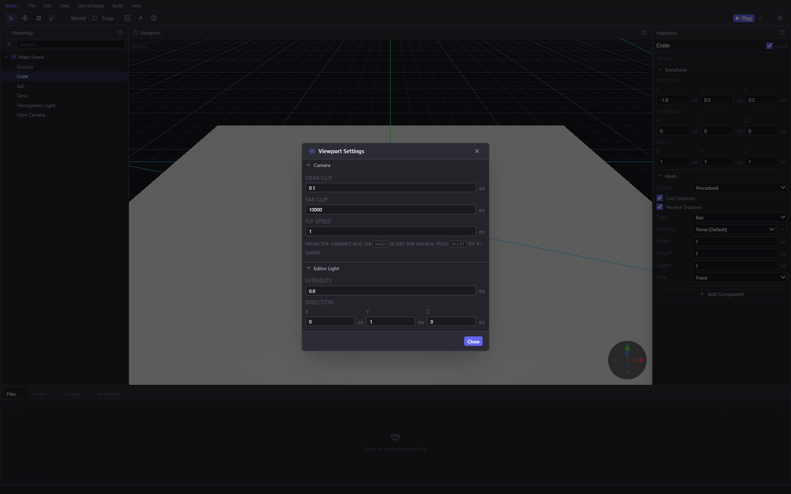

Tunes the editor camera and default light — near/far clip planes, WASD fly speed, and the editor
ambient light's intensity and direction. These are user preferences and persist across sessions.

---

## Project settings

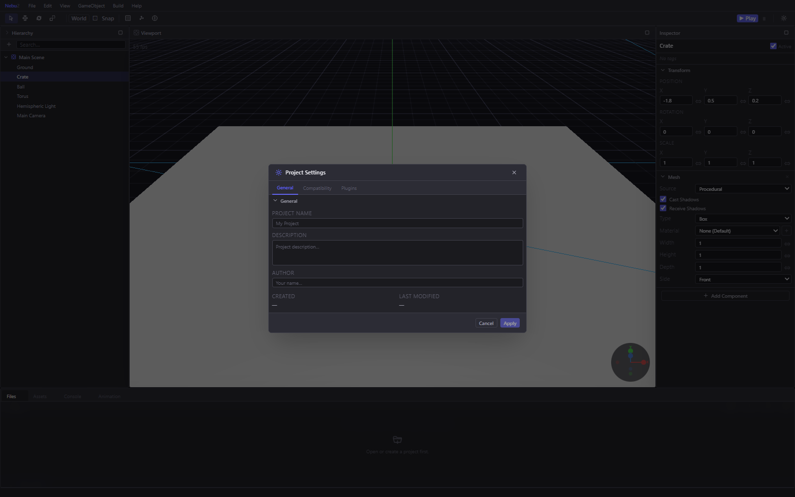

Three tabs:

- **General** — project name, description, author, and timestamps, written to the `.nebu` manifest.
- **Compatibility** — which Babylon engine back-ends the project targets (`webgpu`, `webgl2`,
  `webgl1`). `useEngineCapabilities` probes what the current browser actually supports and
  `resolveEngine` picks the best available target in priority order.
- **Plugins** — see below.

---

## Plugins

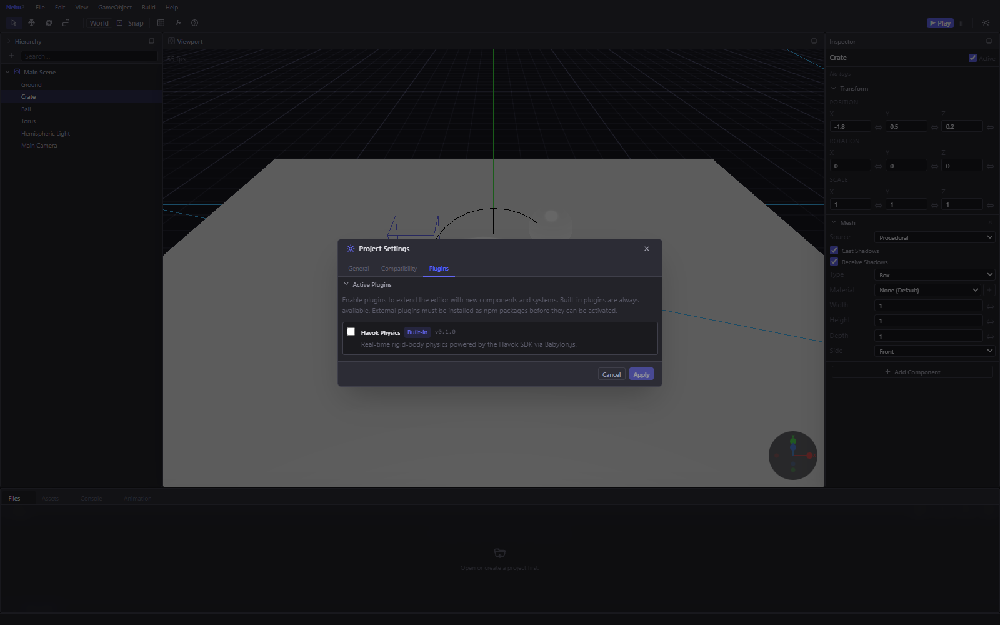

Plugins are enabled **per project** and the active set is persisted in `.nebu`, so reopening a
project reactivates them.

A plugin is a single `NebuPlugin` descriptor (`types/plugin.ts`) that contributes ECS components,
ECS systems, optional async setup (`onActivate`), teardown (`onDeactivate`), world-swap handling
(`onWorldChanged`), and ambient TypeScript declarations for the script editor.

**`@nebu/plugin-havok`** ships in the monorepo and is the reference implementation. It contributes:

| Component | Purpose |
|---|---|
| `PhysicsWorld` | Scene-wide physics configuration (gravity, sub-steps) |
| `Collider` | Collision shape for an entity |
| `RigidBody` | Motion type (Dynamic/Static/Animated), mass, friction, restitution, damping |
| `PhysicsConstraint` | Joints between bodies |

It loads the Havok WASM on activation — `vite.config.ts` has a dedicated `havokWasm` plugin that
serves `HavokPhysics.wasm` with the correct MIME type in dev and emits it into `dist/` on build.

Writing your own: **[PLUGIN_GUIDE.md](../packages/nebu-plugin-havok/PLUGIN_GUIDE.md)**.

---

## Export

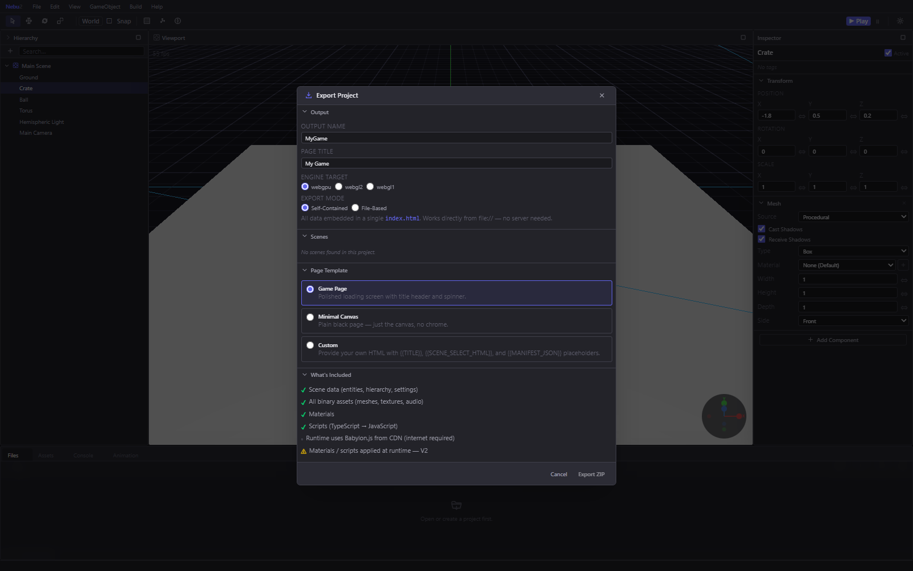

**Build → Export Project…** (`Ctrl+B`) produces a zip.

| Option | Choices |
|---|---|
| Output name | Folder and zip base name |
| Page title | `<title>` of the exported page |
| Engine target | `webgpu` / `webgl2` / `webgl1` |
| Export mode | **Self-Contained** or **File-Based** |
| Scenes | Pick and order the scenes to bundle; index 0 auto-loads |
| Page template | **Game Page** (loading screen, title header, spinner), **Minimal Canvas**, or **Custom** HTML |

**Self-Contained** embeds everything in a single `index.html` — assets as base-64 data URLs, scenes
and materials as JSON, scripts as transpiled JS. It runs straight from `file://` with no server.

**File-Based** writes `scenes/`, `assets/`, `materials/` and `scripts/` as separate files and the
runtime `fetch()`es them, which needs a web server (`npx serve MyGame/`).

Either way the page carries a `window.__NEBU_MANIFEST` describing what to load. Scripts are
transpiled with Sucrase through the same pipeline the editor uses, so the same import rewriting
applies.

The dialog's **What's Included** section reports exactly what the runtime reconstructs. Supported
today: scene data, procedural meshes, lights and shadows, cameras, Standard/PBR materials with
textures, the full NebuScript lifecycle, and Havok physics. Not yet supported: imported GLB/GLTF
mesh assets, and Shader / Custom / PBRCustom materials.

---

## Undo and redo

`commandStore` holds an undo/redo stack of `ICommand` objects. <kbd>Ctrl</kbd>+<kbd>Z</kbd> undoes,
<kbd>Ctrl</kbd>+<kbd>Y</kbd> (or <kbd>Ctrl</kbd>+<kbd>Shift</kbd>+<kbd>Z</kbd>) redoes. Shortcuts are
ignored while typing in an input.

Covered today: create/destroy/rename/reparent/copy/paste entity, add/remove component, property
edits, gizmo drags, and the animation clip/track/keyframe operations. The history is cleared when the
active scene changes so commands can't hold stale component references.

---

## Session persistence

On exit the editor saves an `EditorPrefs` + panel-layout snapshot (`types/session.ts`,
`SESSION_VERSION`) to `localStorage`, and restores it on the next run. Panels are matched by
component name rather than runtime ID so the mapping stays stable. Volatile state — selection, open
dialogs — always resets. A version mismatch discards the saved session rather than restoring
something incompatible.

Scene and project data never live here; they live in the project folder on disk.
